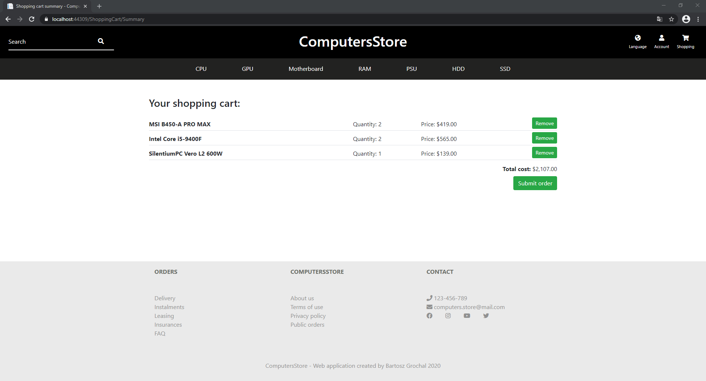
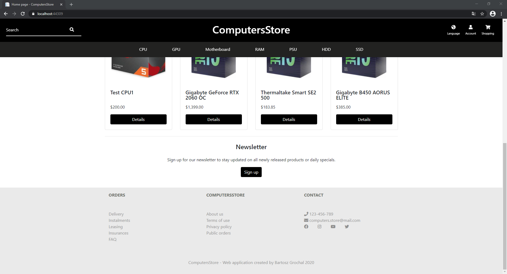
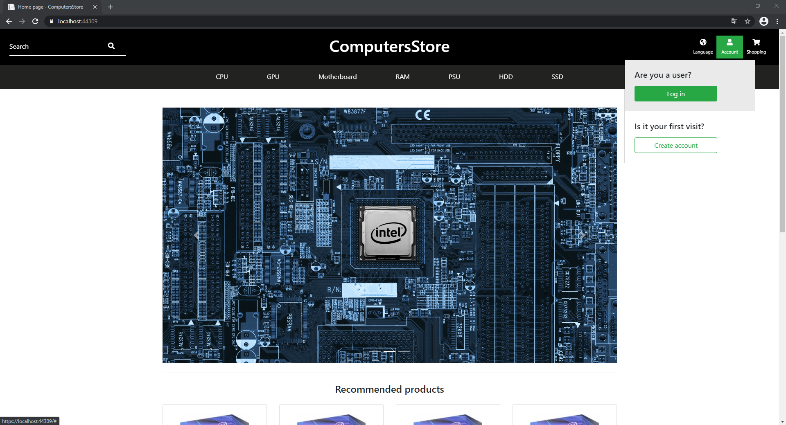

# Computers Store
> An online store built with ASP.NET Core MVC.

## Table of contents
* [General info](#general-info)
* [Features](#features)
* [Screenshots](#screenshots)
* [Technologies](#technologies)
* [Status](#status)

## General info

ComputersStore is an e-commerce application example built with ASP.NET Core MVC. 
It offers well-known features characteristic for popular online stores like shopping cart or newsletter service. 
Project was divided into seven smaller projects to separate different layers of application. Solution consists of following projects: 

* ComputersStore.Data -> class library containing model’s entity classes with dictionaries for specific values like statuses or categories
* ComputersStore.Database -> class library containing database’s context with data seeder, migrations and configurations of entities
* ComputersStore.Services -> class library with services which performs operations on database using database context class
* ComputersStore.Models -> class library containing viewmodels for MVC views with mapper’s specific staff like mapping profiles, custom resolver and attributes
* ComputersStore.BusinessServices -> class library with business services which are responsible for mapping data (entities into viewmodels and vice versa) and calling methods from services
* ComputersStore.EmailHelper -> class library containing logic responsible for sending emails
* ComputersStore.EmailTemplates -> Razor class library with the emails’ templates
* ComputersStore.WebUI -> MVC project with controllers, views, etc.

Project uses SQL Server to store data in the database. The database is managed by EF Core and was created with Code-First approach. 
The whole layout of application was created with Bootstrap and it is fully responsive. Of course, I created some CSS additional classes 
to customize Bootstrap’s default styles. Additional CSS and JS code is bundled into single single files using BuildBundlerMinifier.
For handling different types of products with various properties I decided to implement TPH (Table per Hierarchy) 
for products’ table (inheritance for both entities and view models). 
For this reason, I had to prepare special model binders to handle derived classes properly inside controller’s actions. 
The emails’ templates are Razor views (*.cshtml) with specific view models which are converted into HTML and sent to user using service.

## Features

As an anonymous user you can only view products and sign up for the email newsletter service.

A newsletter message example: 

If you want to add products to the shopping cart and create a new order you need to register and then confirm your email address using confirmation link from email message.

After that, you are able to add products to shopping cart and create new order by submitting cart.

When a new order will be created you will receive an email message.

If status of your order will be changed you will also receive info about it.

As a logged user you can check details of all your orders. You are able to modify your account’s data and change password. 

Admin is a special type of user. He can perform CURD operations on products, basic users, admins, etc..

##Screenshots

## Technologies
* ASP.NET Core MVC
* ASP.NET Core 3.1
* AutoMapper 9.0.0
* BuildBundlerMinifier 3.2.449
* Entity Framework Core 3.1.2
* ASP.NET Core Identity 3.1.1
* NETCore.MailKit 2.0.3
* NewtonSoft.Json 12.0.3

## Status
Project is finished at the moment but in the future it will be migrated to .NET 5.
